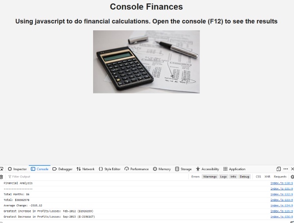

# Console-Finances
Using JavaScript to analyse financial information

## An exercise in analysing financial data using javascript

This project has been created to demonstrate how numerical data and arrays can be accessed and manipulated using JavaScript. 
Iteration, arrays and operators and conditional statements are used.

## Usage

View on GitHub Pages here: [https://webtam81.github.io/Console-Finances/](https://webtam81.github.io/Console-Finances/) and press F12 to open the console and see the results.

## License

MIT License. See license file for further details.